### Nama : Brian Mohamad Safiudin
### NIM : 2141720133
### Kelas : TI-3A
---

# Praktikum 1: Event Handler

`React/Nextjs` memiliki event handler untuk merespon event yang dilakukan oleh pengguna di sebuah halaman website. Untuk menambahkan event handler, pertama-tama kita akan mendefinisikan sebuah fungsi dan kemudian mengopernya sebagai prop ke tag JSX yang sesuai.

## Langkah 1
#### Kita mencoba membuat tombol sederhana yang belum bisa melakukan apa-apa alias belum kita buat event handler untuk tombol tersebut. Sebagai contoh, berikut adalah sebuah tombol yang belum melakukan apa pun.


## Langkah 2
#### Kita bisa menambahkan event pada tombol tersebut. Seperti contoh kita buat ketika tombol di klik, akan memunculkan notif/alert.

- Deklarasikan sebuah fungsi bernama `handleClick` di dalam komponen Button kita.
- Implementasikan logika di dalam fungsi tersebut (gunakan `alert` untuk menampilkan pesan).
- Tambahkan handler `onClick={handleClick}` ke tag JSX `< button >`

Kita butuh mengatur agar komponen yang kita gunakan menjadi komponen client. Untuk menjadikan komponen client, kita cukup memberikan perintah ini `"use client";` pada baris pertama file `page.tsx`

Kita mendefinisikan fungsi `handleClick` dan kemudian mengopernya sebagai prop ke `< button >`. Method handleClick adalah sebuah event handler pada tombol tersebut.

Method `event handle` HARUS dioper (ditulis nama fungsinya, tanpa tanda kurung `()`), bukan dipanggil/call (nama fungsi ditulis dengan tanda kurung `()`).


#### Selain itu, sebagai alternatif, Kita juga dapat mendefinisikan event handler secara inline dalam JSX secara langsung seperti berikut

```tsx
    return (
        <button 
            className="bg-blue-500 hover:bg-blue-700 text-white p-2 rounded"
            onClick={handleClick}
            // onMouseOver={handleMouseOver}
            onMouseLeave={() => {
                    alert("Loh, Brian kok sudah pergi!!!")
                }
            }
        >
            Ini tombol Brian
        </button>
    )
```


---

# Praktikum 2:

Pada `component`, hanya ada 1 fungsi yang memiliki `default` !

Parameter `isiPesan` dan `namaTombol` bisa diisi oleh layout yang ada di `page.tsx` nanti, sehingga komponen `Tombol_2` bernilai dinamis.


#### Jelaskan mengapa bisa seperti itu?

- Karena pada parameter `isiPesan` dan `namaTombol` bisa diisi oleh tata letak (layout) yang ada di file `page.tsx`. Ini berarti bahwa nilai untuk kedua parameter tersebut akan ditentukan `dinamis` oleh komponen yang menggunakan tombol tersebut di dalam `page.tsx`.

---

# Praktikum 3: Propagation

## Langkah 1 - Start Propagation
#### Jalankan di browser, coba klik Tombol-1, dan amati apa yang terjadi?

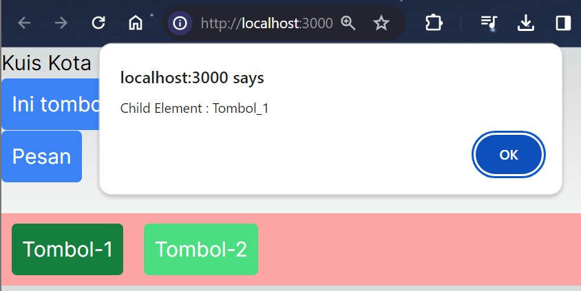
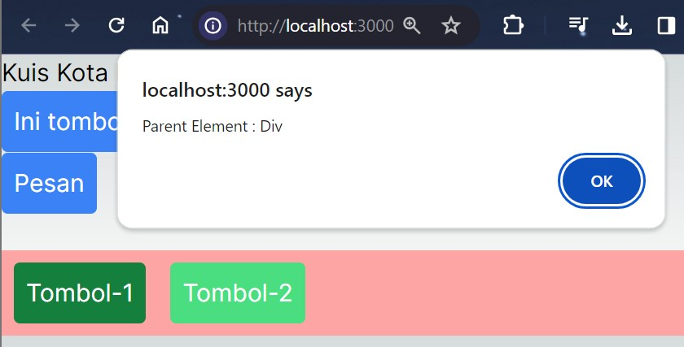

- Kita akan disuguhkan dengan pesan/alert sebanyak 2 kali, yaitu Pesan `"Child Element : Tombol-1"` dan pesan `"Parent Element : Div"`.

- Hal ini terjadi karena baik untuk element `div maupun button memiliki event yang sama yaitu onClick`, sehingga ketika button diklik maka event handler untuk onClick pada button akan dijalankan. Kemudian baru event handler dari parent (element div) akan dijalankan.

## Langkah 2 - Stop Propagation

#### Objek event dapat memungkinkan untuk menghentikan propagasi. Jika kita ingin mencegah sebuah event untuk mencapai komponen induknya (propagation), Kita harus memanggil e.stopPropagation() untuk mencegah propagasi.

```tsx
    return (
        <button
            className="bg-green-400 hover:bg-green-700 text-white p-2 rounded m-2"
            onClick={(e) => {
                    e.stopPropagation()
                    alert(isiPesan)
                }
            }>
            {namaTombol}
        </button>
    );
```

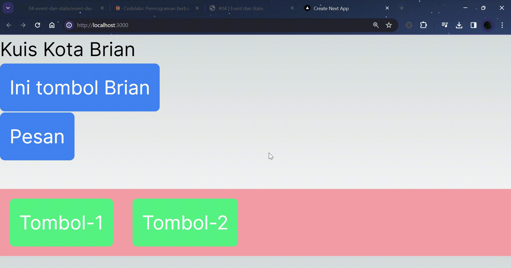

---

# Praktikum 4:

## Langkah 1 - Membuat File Data Dummy
#### Sekarang coba di browser dan klik tombol "Artikel Selanjutnya" dan perhatikan apa yang terjadi?

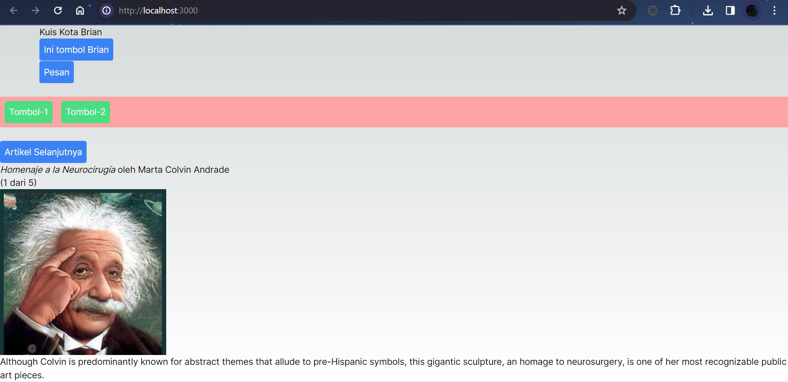

- Ya, tidak terjadi apa-apa 😀. Karena kita belum membuat event handler untuk tombol tersebut.

Event handler `handleClick` memperbarui nilai variabel `index`. Namun dua hal mencegah pembaruan tersebut ditampilkan ke pengguna:

- Variabel lokal tidak dipertahankan antar-render. Saat React me-render komponen ini untuk kedua kalinya, react membuat ulang dari awal, sehingga `index` tetap bernilai 0 dan react tidak memperhatikan adanya perubahan ke variabel `index` tersebut.
- `Perubahan terhadap variabel lokal tidak memicu render`. React tidak menyadari kalau dia perlu melakukan render ulang dengan data yang baru.

Untuk memperbarui komponen dengan data baru, dua hal perlu terjadi:

- `Mempertahankan` data antar-render.
- `Memicu` React untuk merender ulang komponennya dengan data baru.

Dua hal tersebut bisa dicapai dengan Hook `useState`:

- Sebuah `variabel state` untuk mempertahankan data antar-render.
- Sebuah `fungsi state setter` untuk memperbarui variabel dan memicu React untuk merender ulang komponen.

## Langkah 2 - Membuat Variabel State
#### Jalankan pada browser dan amati apa yang terjadi?


- ketika `komponen` tersebut dijalankan di browser, ketika tombol yang sesuai diklik, `variabel state index` akan bertambah satu setiap kali handleClick dipanggil. Ini akan menyebabkan perubahan pada tampilan atau perilaku `komponen Gallery`, tergantung pada bagaimana variabel state tersebut digunakan dalam komponen tersebut.

## Soal 1
#### Jika kita menekan tombol "Artikel Selanjutnya" sebanyak 5x (atau melebihi halaman total artikel), apa yang akan terjadi?

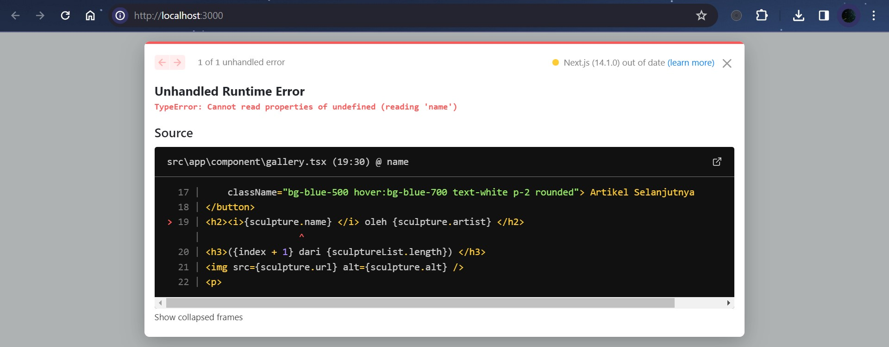

- Terjadi error, tidak dapat membaca properti yang tidak terdefinisi (membaca 'nama').

## Soal 2
#### Modifikasilah gallery.tsx agar bisa meng-handle permasalahan tersebut.

```tsx
    function handleClick() {
        if (index < sculptureList.length - 1) {
            setIndex(index + 1);
        } else {
            setIndex(0);
        }
    };
```

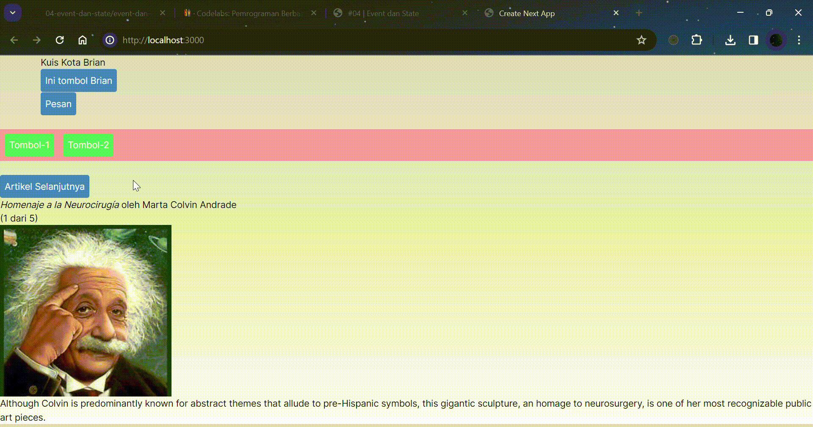

## Soal 3
#### Tambahkan tombol "Artikel Sebelumnya", untuk menampilkan artikel secara mundur.

```tsx
    function handleClickMundur() {
        if (index > 0) {
            setIndex(index - 1);
        } else {
            setIndex(sculptureList.length - 1);
        }
    };
```

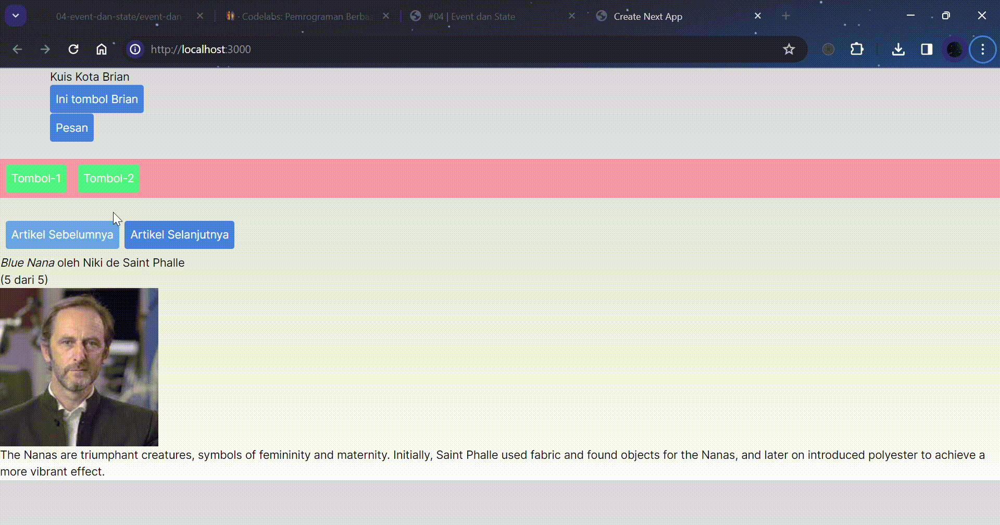

---

# Praktikum 5:

## Langkah 1 - Membuat Form
#### Jalankan pada browser, amati dan laporkan apa yang terjadi?

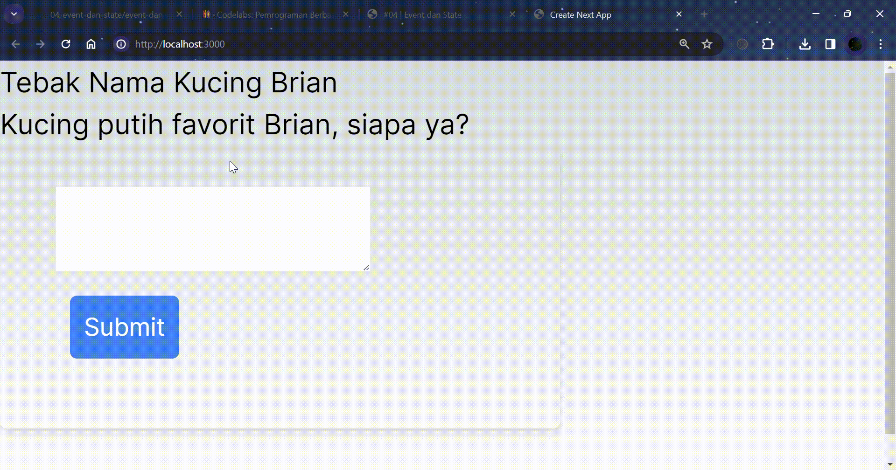

- Ketika saya menjalankan kode tersebut, tampilan awalnya adalah `form` yang meminta pengguna untuk memasukkan jawaban.

- Jika saya memasukkan jawaban yang benar, yaitu `"joshi"`, maka setelah `0,5 detik`, pesan `"Anjay... Jawaban Brian Benar!"` akan muncul, menandakan bahwa status telah diubah menjadi 'success' dan pesan berhasil ditampilkan dengan benar.

- Namun, jika saya memasukkan jawaban yang salah, seperti `"momo"`, maka setelah `0,5 detik`, pesan error `"Jawaban salah! bukan kucing Brian. Silahkan coba lagi!"` akan muncul, menandakan bahwa pesan error ditampilkan dengan benar karena jawaban yang dimasukkan tidak sesuai.

## Langkah 2 - Struktur State
#### Mengatur struktur state dengan baik dapat membuat perbedaan antara komponen yang mudah dimodifikasi dan di-debug, dan komponen yang selalu menjadi sumber error. Perlu dicatat bahwa state

#### tidak boleh mengandung informasi yang tidak perlu atau duplikat. Karena jika ada state yang tidak perlu, mudah untuk lupa memperbarui state tersebut, yang akhirnya memperkenalkan masalah baru!

#### Jalankan pada browser dan amati apa yang terjadi?

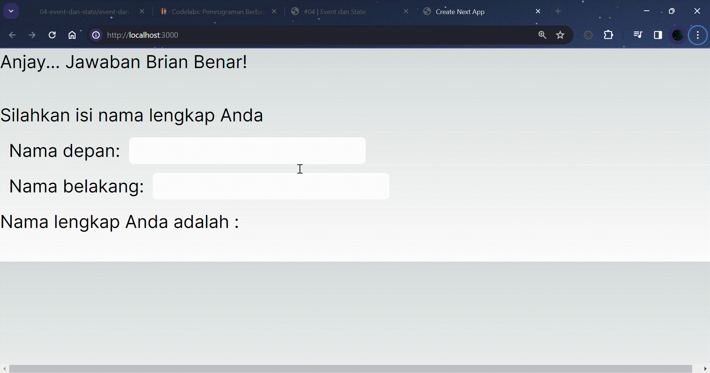

- Ketika saya mengubah nilai pada input `firstName` atau `lastName`, nilai `fullName akan diupdate secara otomatis` karena menggunakan state dari `useState`. Hal ini memastikan bahwa nama lengkap yang ditampilkan selalu sinkron dengan nilai dari input nama depan dan nama belakang.

## Soal 1
#### Apa perbedaan dari fungsi Form_2 yang pertama dengan yang kedua?

- Perbedaan dari fungsi `Form_2` yang pertama dengan yang kedua adalah pada fungsi `Form_2 yang pertama`, kita menggunakan `useState` untuk mengatur state dari `firstName`, `lastName`, dan `fullName`, lalu pada `Form_2 yang kedua` kita menghapus `useState` pada `fullName` karena menyebabkan state redundan dan bisa membuat kesalahan/bug pada aplikasi react/nextjs yang kita buat.

## Soal 2
#### Kenapa perlu menghapus state fullName? Apa keuntungannya?

- Karena `fullName` adalah `derived state` dari `firstName` dan `lastName`, maka kita tidak perlu menyimpannya dalam state. Kita bisa secara langsung dari `firstName` dan `lastName` ketika kita membutuhkannya.

- Keuntungannya adalah mengurangi redundansi data dan memastikan bahwa `fullName` selalu sinkron dengan `firstName` dan `lastName`.

---

# Praktikum 6:

## Langkah 1 - Membuat Accordion
#### Amati dan laporkan apa yang terjadi?

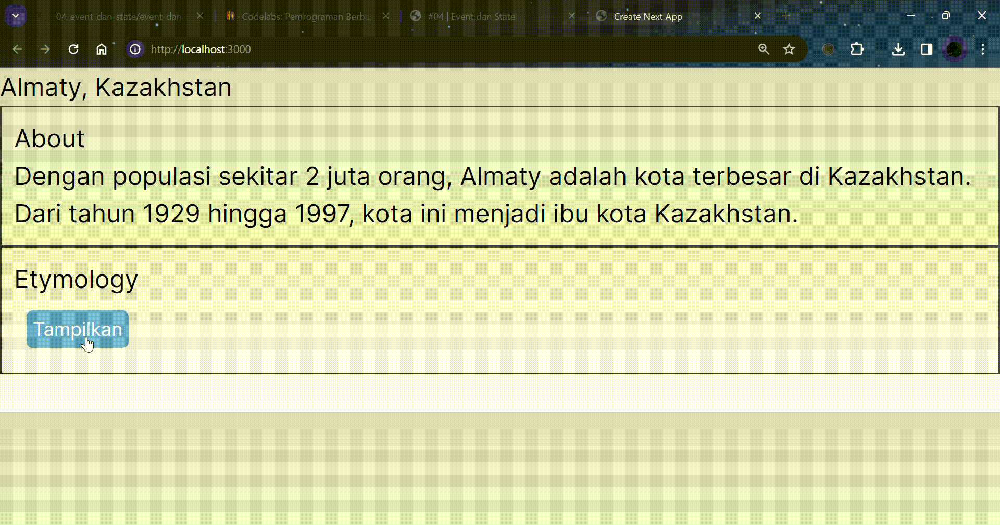

- Pada komponen `Accordion`, terdapat state `activeIndex` yang menentukan panel mana yang sedang aktif (diperluas). Ketika `activeIndex` sama dengan indeks panel (0 untuk panel pertama, 1 untuk panel kedua), maka panel tersebut dianggap aktif.

- Di dalam komponen `Accordion`, kita memiliki dua instansi dari komponen `Panel`. Setiap panel menerima properti `title` (judul panel), `isActive` (menunjukkan apakah panel sedang aktif), dan `onShow` (fungsi yang akan dipanggil saat panel diklik).

- Ketika panel diklik, fungsi `onShow` dipanggil, yang mengatur state `activeIndex` sesuai dengan indeks panel yang diklik.

- Di dalam komponen `Panel`, terdapat pengecekan apakah panel sedang aktif (isActive === true). Jika ya, maka konten panel ditampilkan.

- Dengan demikian, ketika menjalankan kode tersebut, kita akan melihat dua panel dengan judul `"About"` dan `"Etymology"`. Saat salah satu panel diklik, panel tersebut akan diperluas dan menampilkan kontennya. Panel lainnya akan tetap tertutup.

## Langkah 2 - Mempertahankan dan Mengatur Ulang State

Perubahan yang dilakukan dengan menambahkan properti key pada komponen `<Chat>` akan mempengaruhi proses reconcilation yang dilakukan oleh React saat merender daftar komponen.

Ketika kita menambahkan properti `key` pada sebuah komponen dalam daftar, React akan menggunakan nilai dari properti `key` tersebut untuk mengidentifikasi komponen secara unik di antara saudara-saudaranya. Ini memungkinkan React untuk melakukan updating yang lebih efisien saat daftar komponen berubah, karena React dapat mengidentifikasi komponen yang telah dihapus, ditambahkan, atau diubah urutannya berdasarkan nilai kunci yang berubah.

#### Coba jalankan kembali pada browser, amati dan laporkan perbedaannya.

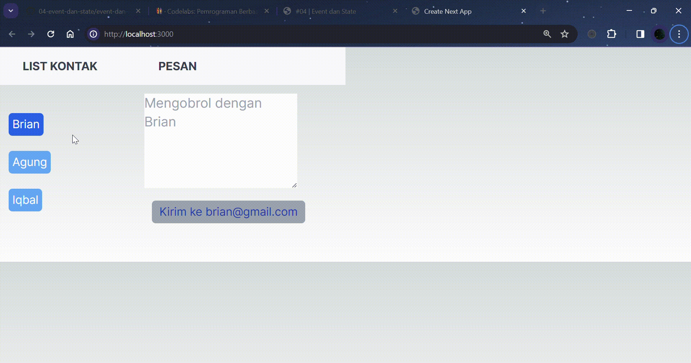

- Dalam kasus ini, `<Chat key={to.email} contact={to} />`, kita menggunakan nilai `to.email` sebagai kunci. Jika `to.email` unik untuk setiap kontak, ini memastikan bahwa setiap komponen `<Chat>` yang mewakili kontak akan dianggap unik oleh React.

- Perbedaannya sebelum perubahan, komponen `<Chat>` dirender tanpa properti `key`. Setelah perubahan, komponen `<Chat>` dirender dengan `properti key={to.email}`.

- Dengan adanya properti `key`, React akan lebih efisien dalam menangani perubahan yang terjadi pada daftar komponen. Ini dapat meningkatkan kinerja aplikasi, terutama ketika kita memiliki daftar komponen yang dinamis dan sering berubah.
