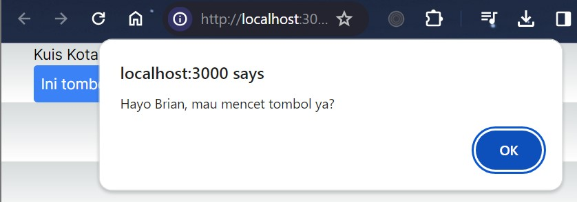

### Nama : Brian Mohamad Safiudin
### NIM : 2141720133
### Kelas : TI-3A
---

# Praktikum 1: Event Handler

`React/Nextjs` memiliki event handler untuk merespon event yang dilakukan oleh pengguna di sebuah halaman website. Untuk menambahkan event handler, pertama-tama kita akan mendefinisikan sebuah fungsi dan kemudian mengopernya sebagai prop ke tag JSX yang sesuai.

## Langkah 1
#### Kita mencoba membuat tombol sederhana yang belum bisa melakukan apa-apa alias belum kita buat event handler untuk tombol tersebut. Sebagai contoh, berikut adalah sebuah tombol yang belum melakukan apa pun.


## Langkah 2
#### Kita bisa menambahkan event pada tombol tersebut. Seperti contoh kita buat ketika tombol di klik, akan memunculkan notif/alert.

- Deklarasikan sebuah fungsi bernama `handleClick` di dalam komponen Button kita.
- Implementasikan logika di dalam fungsi tersebut (gunakan `alert` untuk menampilkan pesan).
- Tambahkan handler `onClick={handleClick}` ke tag JSX `< button >`

Kita butuh mengatur agar komponen yang kita gunakan menjadi komponen client. Untuk menjadikan komponen client, kita cukup memberikan perintah ini `"use client";` pada baris pertama file `page.tsx`

Kita mendefinisikan fungsi `handleClick` dan kemudian mengopernya sebagai prop ke `< button >`. Method handleClick adalah sebuah event handler pada tombol tersebut.

Method `event handle` HARUS dioper (ditulis nama fungsinya, tanpa tanda kurung `()`), bukan dipanggil/call (nama fungsi ditulis dengan tanda kurung `()`).



#### Selain itu, sebagai alternatif, Kita juga dapat mendefinisikan event handler secara inline dalam JSX secara langsung seperti berikut

```tsx
    return (
        <button 
            className="bg-blue-500 hover:bg-blue-700 text-white p-2 rounded"
            onClick={handleClick}
            // onMouseOver={handleMouseOver}
            onMouseLeave={() => {
                    alert("Loh, Brian kok sudah pergi!!!")
                }
            }
        >
            Ini tombol Brian
        </button>
    )
```


---

# Praktikum 2:

Pada `component`, hanya ada 1 fungsi yang memiliki `default` !

Parameter `isiPesan` dan `namaTombol` bisa diisi oleh layout yang ada di `page.tsx` nanti, sehingga komponen `Tombol_2` bernilai dinamis.


#### Jelaskan mengapa bisa seperti itu?

- Karena pada parameter `isiPesan` dan `namaTombol` bisa diisi oleh tata letak (layout) yang ada di file `page.tsx`. Ini berarti bahwa nilai untuk kedua parameter tersebut akan ditentukan `dinamis` oleh komponen yang menggunakan tombol tersebut di dalam `page.tsx`.

---
